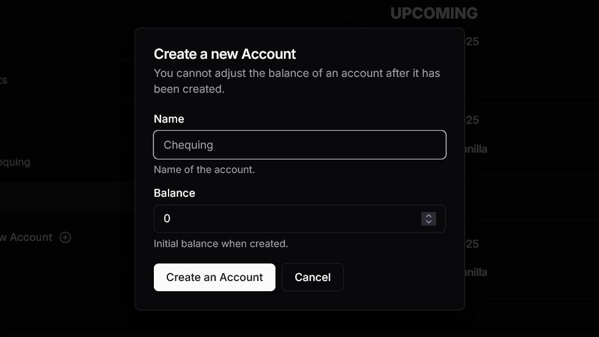

<h1 align="center">
  <br />
  Transact (WIP)
  <br />
</h1>

<p align="center">
  <a href="#why-should-i-use-this-app">Why</a> •
  <a href="#documentation">Documentation</a> •
  <a href="#core-process">How</a> •
  <a href="#getting-started">Contributing</a>
</p>

Transact is an application designed to help users track their expenses, income, and overall financial status. It provides a convenient way to categorize and visualize financial data through graphs.


   

# Why Should I use this App?

With this app, users can record their expenses and income, assigning them to specific categories such as groceries, transportation, entertainment, or any other custom categories they define. By categorizing their transactions, users can gain insights into their spending habits and identify areas where they can potentially save money.

In addition to tracking individual expenses and income, the app also calculates the net amount, which represents the difference between the total income and total expenses. This allows users to see their overall financial status at a glance.

One of the key features of the Finance Tracker App is its ability to generate graphs and charts based on the recorded data. These visual representations provide a clear overview of the user's financial situation over time. Users can choose different types of graphs, such as bar charts or pie charts, to visualize their expenses and income in a way that is easy to understand.

By using the Finance Tracker App, users can gain better control over their finances, make informed decisions about their spending, and work towards achieving their financial goals.

The Finance Tracker App lists your income and expenses and posts them as a graph and informatics.

## Important Files
```
transact/
├── docs/
│   ├── conventions/
│   │   ├── coding_conventions.md
│   │   └── best_practices_in_next.md
│   ├── design/
│   │   ├── software_design.md
│   │   ├── database_design.md
│   │   ├── data_design_for_visualizations.md
│   │   └── system_architecture.md
│   ├── discussion/
│   │   └── component_folder_organization.md
│   ├── ...
│   ├── style/
│   │   └── style_guide.md
│   ├── CHANGELOG.md
├── ERD_and_Implementation/
│   ├── diagrams/...
│   ├── Plan.erd
│   ├── Requirements.todo
│   └── ...
├── src/
│   ├── app/
│   └── ...
├── README.md
├── LICENSE
└── ...
```

## Documentation
- [Software Design](./docs/design/software_design.md)
- [Data Design for Visualizations](./docs/design/data_design_for_visualizations.md)
- [System Architecture](./docs/architecture/system_architecture.md)
- [Coding Conventions](./docs/conventions/coding_conventions.md)
- [Style Guide](./docs/style/style_guide.md)

## Core Process
### Data Flow
You can find the software's data flow [here](./docs/design/software_design.md).

## Getting Started
This project is an offline-first based app which means you can easily run and use the application with a few commands:

1. Clone the project by using:
```bash
git clone https://github.com/ssanjose/transact.git
# or
git clone (your-forked-repo)
```

2. Go to the directory and run the development server:

> [!NOTE]
> Go into the folder with `cd ./transact`

```bash
npm run dev
# or
yarn dev
# or
pnpm dev
# or
bun dev
```

Open [http://localhost:3000](http://localhost:3000) with your browser to see the result.

You can start editing the page by modifying `app/page.tsx`. The page auto-updates as you edit the file.

This project uses [`next/font`](https://nextjs.org/docs/basic-features/font-optimization) to automatically optimize and load Inter, a custom Google Font.

## Learn More

To learn more about the tools used in the app, take a look at the following resources:
- [Next.js Documentation](https://nextjs.org/docs) - learn about Next.js features and API.
- [shadcn/ui Documentation](https://ui.shadcn.com/) - a collection of re-usable components that can be copy and pasted into your apps.
- [Tailwind Documentation](https://tailwindcss.com/) - a utility-first CSS framework that can be use directly in your markup.

# Deployment (Coming Soon)
Soon to be deployed with GitHub pages