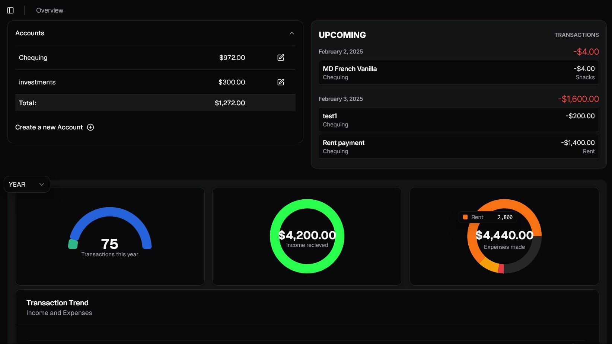
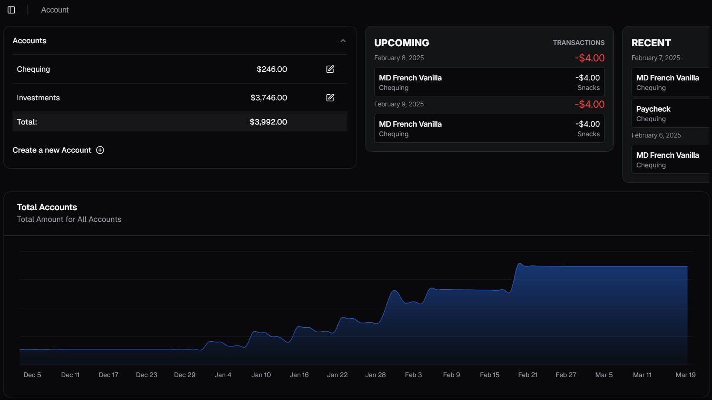
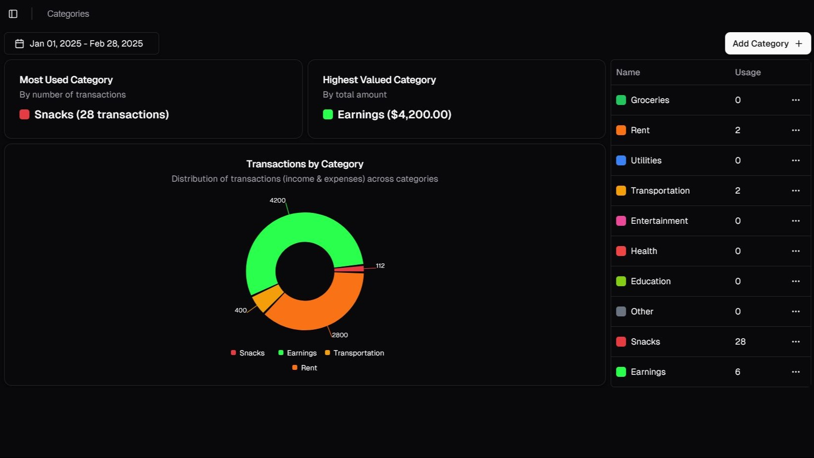

<h1 align="center">
  <br />
  
  <br />
  Transact (WIP)
  <br />
</h1>

[](https://github.com/ssanjose/transact/actions/workflows/playwright.yml)

<div>
  <p align="center">
    --
  </p>
  <p align="center">Features left before v0.2.0 release: TBD</p>
</div>

<p align="center">
  <a href="#why-should-i-use-this-app">Why</a> •
  <a href="#key-features">Features</a> •
  <a href="#documentation">Documentation</a> •
  <a href="#how">How</a> •
  <a href="#getting-started">Contributing</a>
</p>

Transact is an application designed to help users track their expenses, income, and overall financial status. It provides a convenient way to categorize and visualize financial data through graphs.


   

# Why Should I use this App?

Transact is an offline-first account tracking application designed for people who prefer an offline, set it and leave it approach to managing their assets. 

It allows users to record their expense and income and assign them to specific categories, transfer money between accounts in a straightforward manner, and gain insights into their habits and identify areas where they can potentially save cash.

In addition to tracking individual expenses and income, the app also calculates the net amount, which represents the difference between the total income and total expenses. This allows users to see their overall financial status at a glance.

One of Transact's key features is its ability to generate graphs and charts based on the recorded data. These visual representations provide a clear overview of the user's financial situation over time. Users can choose different time bounds and present them in different graphs, such as bar charts or pie charts, to visualize their expenses and income in a way that is easy to understand.

## Key Features
- **PWA Capability**: Download the app for offline-use. No need to connect to the internet.
- **Transaction Tracking**: Track your income, expenses, and transfers in one app.
- **Accounts Support**: Set up multiple accounts resembling your money storage(banks, wallets, etc.).
- **Customizable Currency**: Choose your currency from the list of supported currencies.
- **Recurring Transactions**: Automate your transactions by setting them as Daily, Weekly, or Monthly. 
- **Data Visualization**: See your data presented as graphs and charts.

## Caveats and Warnings
This app is an offline-first app, meaning you can use it without internet. However, this does pose many security risks:
1. Your financial data is stored in an IndexedDB database, which is a huge security risk. Use this app as intended, and do not create transactions with crucial information such as real names, your bank account details, etc.
2. This is not a budgeting or an accounting application, if you need those features, please check other apps like YNAB.

## How
Check out our [Wiki](https://github.com/ssanjose/transact/wiki) for more information.

### Data Flow
You can find the software's data flow [here](./docs/design/software_design.md).

## Documentation
- [Software Design](./docs/design/software_design.md)
- [Data Design for Visualizations](./docs/design/data_design_for_visualizations.md)
- [System Architecture](./docs/design/system_architecture.md)
- [Coding Conventions](./docs/conventions/coding_conventions.md)
- [Style Guide](./docs/style/style_guide.md)
- [Testing Guide](./docs/conventions/testing.md)

### Important Files
```
transact/
├── docs/
│   ├── conventions/
│   │   ├── coding_conventions.md
│   │   └── best_practices_in_next.md
│   ├── design/
│   │   ├── software_design.md
│   │   ├── database_design.md
│   │   ├── data_design_for_visualizations.md
│   │   └── system_architecture.md
│   ├── diagrams/...
│   ├── discussion/
│   │   └── component_folder_organization.md
│   ├── style/
│   │   └── style_guide.md
│   ├── Plan.erd
│   ├── Requirements.todo
│   ├── CHANGELOG.md
│   └── ...
├── src/
│   ├── app/
│   └── ...
├── README.md
├── LICENSE
└── ...
```

## Getting Started
> [!IMPORTANT]
> If you want to contribute, please take a look at the [Requirements file](./docs/Requirements.todo) and afterward, make an issue detailing what feature do you want to develop. Help is always appreciated! :)
> Also see, [CONTRIBUTING](https://github.com/ssanjose/transact/blob/master/CONTRIBUTING.md)

This project is an offline-first based app which means you can easily run and use the application with a few commands:

1. Clone the project by using:
```bash
git clone https://github.com/ssanjose/transact.git
# or
git clone (your-forked-repo)
```

2. Go to the directory and run the development server:

> [!NOTE]
> Go into the folder with `cd ./transact`

```bash
npm run dev
# or
yarn dev
# or
pnpm dev
# or
bun dev
```

Open [http://localhost:3000](http://localhost:3000) with your browser to see the result.

This project uses [`next/font`](https://nextjs.org/docs/basic-features/font-optimization) to automatically optimize and load Inter, a custom Google Font.

## Learn More

To learn more about the tools used in the app, take a look at the following resources:
- [Next.js Documentation](https://nextjs.org/docs) - learn about Next.js features and API.
- [shadcn/ui Documentation](https://ui.shadcn.com/) - a collection of re-usable components that can be copy and pasted into your apps.
- [Tailwind Documentation](https://tailwindcss.com/) - a utility-first CSS framework that can be use directly in your markup.

## Deployment
Using Vercel for deployment.

Deployed with [GitHub Workflows](https://github.com/ssanjose/transact/wiki/GitHub-Actions-(CI-&-CD))

See our site at : [transact.kurtsanjose.dev](https://transact.kurtsanjose.dev)

## Acknowledgements
(TBD)
